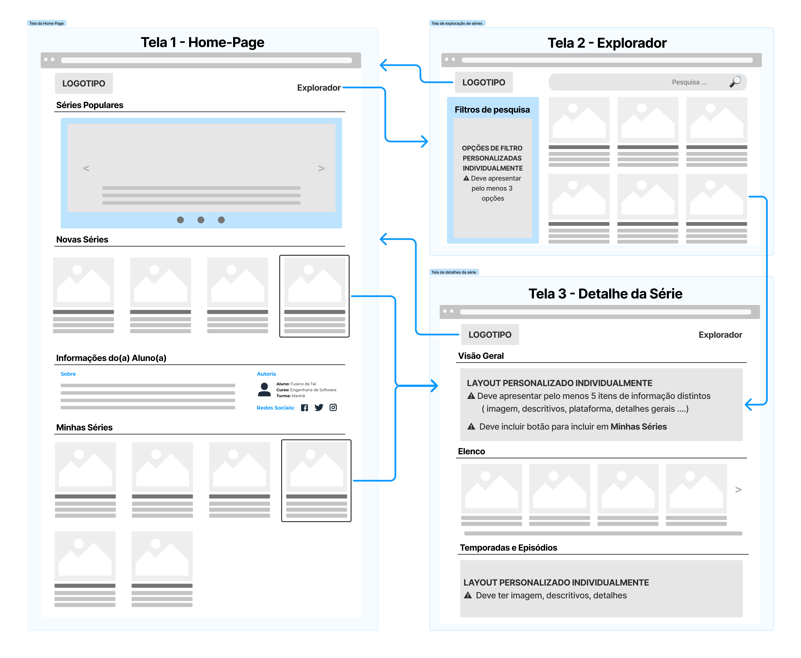

# Projeto de Apresentação de Séries Responsivo

## Descrição

Este projeto é um site de apresentação de séries, desenvolvido com HTML, CSS e Bootstrap, projetado para ser totalmente responsivo e adaptável a diferentes tamanhos de tela. O site exibe séries com suas informações, temporadas, episódios, e permite ao usuário explorar detalhes de cada série. O projeto foi realizado como parte de um trabalho da faculdade, na disciplina de **Desenvolvimento de Interfaces Web**.

## Tecnologias Utilizadas

- **HTML**: Estruturação do conteúdo da página.
- **CSS**: Estilização do site, incluindo layout e responsividade.
- **Bootstrap**: Utilizado para estilização e responsividade, facilitando a construção de componentes como botões, cards, acordeões, etc.
- **FontAwesomeIcons**: Para icones customizados.
- **Flexbox**: Utilizado para criar layouts flexíveis e alinhamento de elementos.
- **Grid**: Aplicado para organizar o conteúdo em grades, facilitando a exibição de séries e episódios.

## Estrutura do Projeto

- **index.html**: Página inicial que contém a apresentação das séries, incluindo informações como elenco, temporadas, episódios e botões de interação.
- **explorer.html**: Página para utilizar filtros e pesquisar entre as diversas séries.
- **serie.html**: Apenas um template para as futuras séries que terão no sistema, apresenta todos os detalhes sobre a série, elenco, episódios e temporadas.

### Principais Componentes:

1. **Cabeçalho**: Contém o nome do site e uma barra de navegação com links para o "Início" e o "Explorador".
2. **Seção "Populares"**: Por meio de um "carrossel" de imagens, apresenta banners de algumas séries populares.
3. **Seção "Novidades"**: Apresenta algumas séries que foram adicionadas recentemente.
4. **Seção "Informações do Aluno"**: Apresenta algumas informações minhas, feita de acordo com o wireframe disponibilizado.
5. **Elenco**: Na página de detalhes da série, pode ser visualizado uma parte do elenco da mesma.
6. **Acordeão de Temporadas**: Implementado para cada série, exibindo suas respectivas temporadas e episódios com descrições e botões para assistir.
7. **Barra de Pesquisa**: Permite aos usuários pesquisar por séries específicas.
8. **Filtros de Pesquisa**: Permite aos usuários filtrar séries por meio de alguns filtros pré-definidos, como idioma, gênero, avaliação e elenco.
9. **Sistema de Avaliações**: Nos cards de cada série há um trecho apresentado por uma "barra de progresso de estrelas", indicando a porcentagem atual de avaliações.
10. **Categorias**: Utilizado o sistema de badges do Bootstrap para indicar as categorias das séries.
11. **Favoritar**: Um sistema para favoritar séries, e essas serem apresentadas na seção de "Minhas Séries" no Início.

## Como Executar o Projeto

1. Faça o download ou clone o repositório.
2. Abra o arquivo `index.html` no navegador para visualizar o site.
3. Explore o layout responsivo que se adapta a diferentes tamanhos de tela e dispositivos.

## Conclusão

Este projeto é um site simples, mas poderoso, de apresentação de séries, utilizando tecnologias modernas como Bootstrap para garantir uma experiência fluida em qualquer dispositivo. Ele pode ser facilmente expandido para incluir funcionalidades mais avançadas.

Meu GitHub: [Eman134](https://github.com/Eman134)
